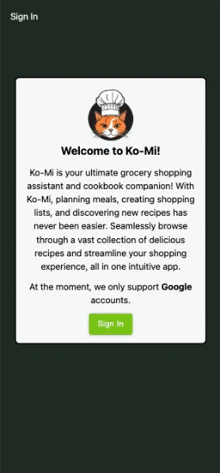
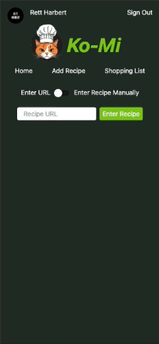
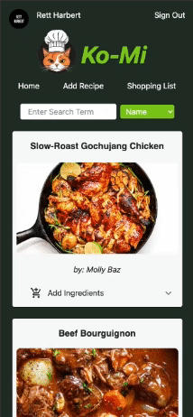

<!-- # Ko-Mi -->
<div align="center">
  
<h1 align="center">Ko-Mi</h1>
<a href="https://ko-mi.io">View Live</a>
</div>

## About

<p>Ko-Mi is your ultimate grocery shopping assistant and cookbook companion! With Ko-Mi, planning meals, creating shopping lists, and discovering new recipes has never been easier. Seamlessly browse through a vast collection of delicious recipes, organize your ingredients, and streamline your shopping experience, all in one intuitive app.</p>

<div>
  PetCentral is a full-stack application that allows users to connect with other pet owners in their area.

Some of our key features are:

  <ul>
    <li>
      <h3>Secure Sign-in</h3>
      <p>Sign in with Google OAuth. Rest easy knowing that your safety and privacy are a top priority!</p>
      
    </li>
    <br/>
    <li>
      <h3>Main Page</h3>
      <p>Browse all the recipes that you've added. A custom cookbook with only the necessary information for each recipe! You're able to add ingredients to your shopping list and scale them appropriately. </p>
        
    </li>
    <br/>
    <li>
      <h3>Search Recipes</h3>
      <p>
        Filter and search recipes to find whatever you desire in your cookbook. Search by Keyword, Author, Title, or Ingredients!
      </p>
      
    </li>
    <br/>
    <li>
      <h3>Add a Recipe</h3>
      <p>Add to your cookbook by inputting a URL or build a custom recipe card! Our site is able to grab the necessary information from most sites then create a recipe card. </p>
        
    </li>
    <br/>
    <li>
      <h3>Shopping List</h3>
      <p>View items in your shopping list and check them off as needed. Add custom items to make it your single resource when looking through your supplies at home or browsing the store.</p>
      
    </li>
    <br/>

  </ul>
</div>

## What's in a name?

<p>Ko-Mi is a phoenetic spelling of "commis," the French term for a professional kitchen assistant who works under the supervision of a chef.</p>

### Built With


<!-- need to add MUI, vercel -->

## Getting Started

<p>
  Before getting started with Ko-Mi please ensure that you have a database set up to work with Prisma. We highly recommend <a href="https://supabase.com" target="_blank">Supabase</a>
</p>

### Prerequisites


```sh
npm install npm@latest -g
```


Node version is expected to be v20.10.0 or higher

```sh
nvm install --lts
node --version
```

### Installation

1. Clone the repo
   ```sh
   git clone https://github.com/tgharbert/Ko-Mi.git
   ```
2. Install NPM packages
   ```sh
   npm install
   ```
3. Rename `.env.example` to `.env` and fill in the following fields:
   ```
    GOOGLE_CLIENT_ID
    GOOGLE_CLIENT_SECRET
    DATABASE_URL
    NEXTAUTH_SECRET
    NEXT_PUBLIC_SUPABASE_URL
    NEXT_PUBLIC_SUPABASE_ANON_KEY
   ```
   Check NextAuth.js documentation for more information on how to set up OAuth providers
4. Run Prisma generate to generate the Prisma client

```sh
npx prisma generate
```

5. Push schema to the database

```sh
npm run db:push
```

<!--
Optionally, seed the database

```sh
npm run db:seed
``` -->

6. Run the development server

```sh
npm run dev
```

<!-- BOTTOM -->

This is a [Next.js](https://nextjs.org/) project bootstrapped with [`create-next-app`](https://github.com/vercel/next.js/tree/canary/packages/create-next-app).

## Getting Started

First, run the development server:

```bash
npm run dev
# or
yarn dev
# or
pnpm dev
# or
bun dev
```

Open [http://localhost:3000](http://localhost:3000) with your browser to see the result.

You can start editing the page by modifying `app/page.tsx`. The page auto-updates as you edit the file.

This project uses [`next/font`](https://nextjs.org/docs/basic-features/font-optimization) to automatically optimize and load Inter, a custom Google Font.

<table id='links' align='center'>
  <tr>
    <td>
      <h3 align='center'>Thomas Harbert</h3>
      <div align='center'>
      <a href='https://www.linkedin.com/in/thomasgharbert/'>
        
      </a>
      <a href='https://github.com/tgharbert'>
        
      </a>
      </div>
      <hr />
    </td>
  </tr>
</table>

<!-- ## Learn More

To learn more about Next.js, take a look at the following resources:

- [Next.js Documentation](https://nextjs.org/docs) - learn about Next.js features and API.
- [Learn Next.js](https://nextjs.org/learn) - an interactive Next.js tutorial.

You can check out [the Next.js GitHub repository](https://github.com/vercel/next.js/) - your feedback and contributions are welcome! -->

<!-- ## Deploy on Vercel

The easiest way to deploy your Next.js app is to use the [Vercel Platform](https://vercel.com/new?utm_medium=default-template&filter=next.js&utm_source=create-next-app&utm_campaign=create-next-app-readme) from the creators of Next.js.

Check out our [Next.js deployment documentation](https://nextjs.org/docs/deployment) for more details. -->
